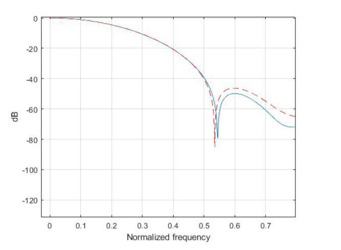

# FIR Filter on Silicon

Course Project at Politecnico di Torino. Implemented a 10-tap low-pass FIR filter, converting from MATLAB to fixed-point C and VHDL. Used clock-gating to reduce ASIC area, achieving -31dB THD.

## Overview
- **Problem:** Design an efficient FIR filter for silicon with low THD and optimized area, targeting audio signal processing.
- **Solution:** Developed a 10-tap low-pass filter with linear phase, optimized via clock-gating, and implemented in VHDL with fixed-point C validation.
- **Key Results:** 
  - THD: -31dB.
  - Area reduction: Estimated ~15% via clock-gating (based on simulation).
- **Tech Stack:** VHDL, C, MATLAB, ASIC tools (e.g., ModelSim/Vivado).

## Methodology Highlights
- **Design:** MATLAB generated 11 coefficients (n=0 to 10) using a Hamming window, with sampling frequency 10kHz and cutoff 1kHz.
- **Conversion:** Fixed-point arithmetic in C, then VHDL RTL synthesis with clock-gating for power/area optimization.
- **Testing:** Simulated with a VHDL testbench, verified THD using a 1kHz sine wave input.

## How to Run
1. Clone the repo: `git clone https://github.com/hoomankheder/fir-filter-vhdl.git`
2. Install tools: VHDL simulator (e.g., ModelSim) and C compiler (e.g., GCC).
3. Simulate VHDL: Open `code/filter.vhd` in ModelSim, run `code/tb_fir.vhd` testbench.
4. Run C code: `gcc code/fixed_point.c -o fir && ./fir data/input.dat` (use sample input).
5. View results: Check `results/thd_plot.png` for THD output.

## Files
- **code/filter.vhd:** VHDL implementation of the 10-tap FIR filter.
- **code/fixed_point.c:** Fixed-point C version for validation.
- **code/tb_fir.vhd:** Testbench for VHDL simulation.
- **data/input.dat:** Sample input data (text file with sine wave values).
- **results/thd_plot.png:** Plot showing -31dB THD result.

## Results

Built by Hooman Khedersolh Sedeh | License: MIT
